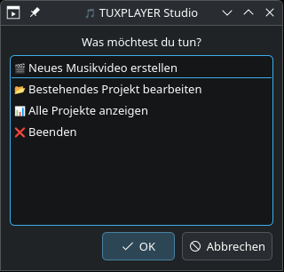
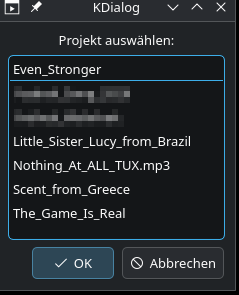
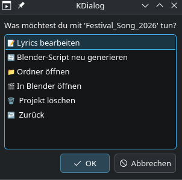
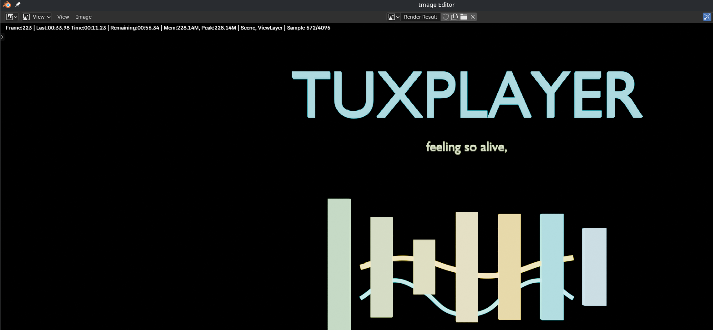

# 🎵 TUXPLAYERS - STUDIO !!!

**Automatisierter Lyrics-Video-Generator für Musiker – powered by Blender, Bash und Python**

  
KDE tuxplayer-studio Auswahlfenster 1 – Was willst du machen?

  
KDE tuxplayer-studio Auswahlfenster – Bestehendes Projekt bearbeiten!

  
KDE tuxplayer-studio Auswahlfenster – Scripte ausführen und neue Datei anlegen!

  
*Typischer fertiger Lyrics-Clip aus Blender*

[🎥 Beispiel-Video Output ansehen (noch nicht hochgeladen)](https://www.youtube.com/link-zu-deinem-video)

---

## ✨ Features

- Grafische KDE-Oberfläche – keine Terminalkenntnisse nötig  
- Vollautomatische Blender-Videoerstellung aus MP3 und Lyrics  
- Multi-Style Visualizer: Metal, Electro, Pop  
- Direkte MP3-zu-Video-Konvertierung in Minuten  
- Optionale Whisper AI für Lyrics-Extraktion  
- Verschiedene Qualitätsstufen: Preview bis 4K  
- Schneller Workflow für Musiker & Content Creators  
---

## 🚀 Installation

### Voraussetzungen (CachyOS/Arch Linux)
sudo pacman -S python blender ffmpeg kde-cli-tools

text

### Klonen des Repos und Starten
git clone git@github.com:Tuxplayers/tuxplayer-studio.git
cd tuxplayer-studio
chmod +x tuxplayer_ultimate.sh
./tuxplayer_ultimate.sh

text

---

## 🛠️ Workflow

1. Song in DAW (z.B. Bitwig Studio) produzieren & als MP3 exportieren  
2. Script starten:  
./tuxplayer_ultimate.sh

text
3. Lyrics eingeben oder automatisch extrahieren  
4. Stil und Qualität wählen  
5. Blender-Script generieren – öffnen und mit `Alt+P` ausführen  
6. Animation rendern (`Ctrl+F12`)  
7. Fertiges Video auf YouTube hochladen!

---

## 📂 Projektstruktur

tuxplayer-studio/
├── tuxplayer_ultimate.sh # Haupt-GUI
├── universal_generator.sh # Script-Generator
├── templates/
│ └── visualizer_base.py # Blender Template
├── projects/ # Video-Projekte
├── mp3_source/ # MP3-Dateien
└── src/ # Tools & Module

text

---

## 🐚 Bash-Alias für Schnellstart

In .bashrc einfügen:
alias tsb='cd ~/scripts/tools/lyrics-tools && ./tuxplayer_ultimate.sh'

text

### Automatisch hinzufügen:
echo "" >> ~/.bashrc
echo "alias tsb='cd ~/scripts/tools/lyrics-tools && ./tuxplayer_ultimate.sh'" >> ~/.bashrc
source ~/.bashrc

text

---

## 🎨 Beispiel-Projekte

- Freiheit Wahrheit (Metal)
- The Game Is Real (Electronic)
- Little Sister Lucy from Brazil
- Festival Song 2026

Jedes Video enthält Equalizer-Animation, TUXPLAYER-Logo & synchronisierte Lyrics!

---

## 📦 Technologie-Stack

- Bash (GUI & Workflow)
- Python (Skripte & Generierung)
- Blender 3.0+ (3D & Rendering)
- FFmpeg (Encoding)
- Whisper AI (Optional, Transkription)
- KDE Dialog (Benutzeroberfläche)

---

## 👤 Autor & Kontakt

Heiko Schäfer (TUXPLAYER)  
Electronic Music Producer  
Stuttgart, Germany  
🌐 [tuxhs.de](https://tuxhs.de)  
📺 [YouTube](https://youtube.com/@tuxplayer)  
🎵 [Bandcamp](https://tuxplayer.bandcamp.com)

---

## 📝 Lizenz

MIT License – siehe [`LICENSE`](LICENSE)

---

## 🌟 Unterstützung

- ⭐ Repo auf GitHub ★starren
- 🐛 Issues & Feature-Wünsche willkommen!
- 🤝 Pull Requests erwünscht

---

Made with ❤️ for the music community  
Von einem Musiker, für Musiker 🎵  

# TUXPLAYERS - STUDIO ROCKE dein Leben !  
